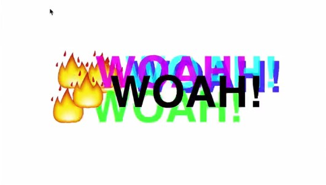

## JavaScript30 Day 16 - Mouse Move Shadow

In this tutorial, we learn to how to make our heading text shadow moves in accordance with the mouse move.

[View demo site here.](https://webdevtuts.github.io/javascript30_16/)

